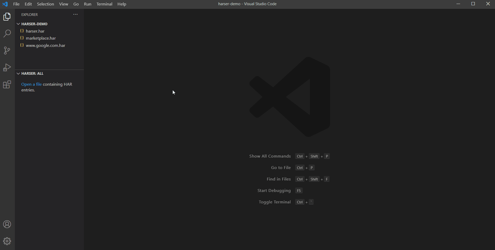

# harser

Generate code from HAR files

## Features

- Generate C# - RestSharp code
- Generate JavaScript - Fetch code
- Request Header Presets

## Extension Settings

This extension contributes the following settings:

Required
- `harser.template.restsharp.cs`: The handlebars template to use for RestSharp.
- `harser.template.fetch.js`: The handlebars template to use for Fetch.

Optional
- `harser.requestHeaders.preset.1`: The handlebars template to use for header preset 1.
- `harser.requestHeaders.preset.2`: The handlebars template to use for header preset 2.
- `harser.requestHeaders.preset.3`: The handlebars template to use for header preset 3.